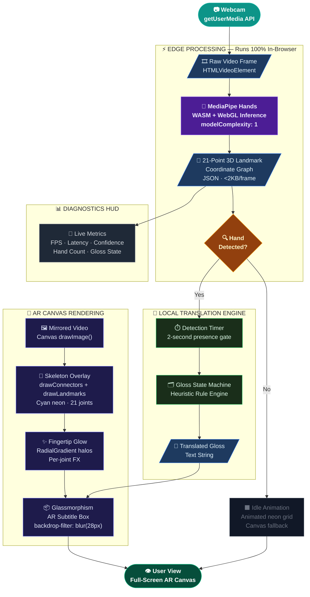

<div align="center">

# ✋ EdgeSign MVP

### *Zero-Latency AR Sign Language Translation at the Edge.*

<br/>

[](https://developer.mozilla.org/en-US/docs/Web/HTML)
[](https://developer.mozilla.org/en-US/docs/Web/JavaScript)
[](https://google.github.io/mediapipe/solutions/hands)
[](https://thestethoguy.github.io/EdgeSign-MVP/)
[](LICENSE)

<br/>


</div>

---

## 🔴 The Problem — Why This Had to Be Built

> **Every existing sign language tool forces the Deaf and Hard of Hearing community to look away from the person they're talking to.**

Current translation software is architected for cloud servers, not for humans. It streams raw video frames to remote inference endpoints — introducing **2–8 seconds of round-trip latency**, burning cellular data, and exposing sensitive biometric footage to third-party servers. The result is a broken conversational loop: a DHH individual must divide attention between the translator UI on a screen and the human in front of them. Natural eye contact — the very foundation of human connection — is shattered. **This is not a UX flaw. It is a fundamental architecture flaw.**

---

## 💡 The Solution — Edge Intelligence, Not Cloud Dependency

EdgeSign pivots the entire stack from the server to the **browser itself**.

Instead of streaming video to the cloud, EdgeSign runs **Google MediaPipe Hands** entirely on-device via WebAssembly + WebGL. The webcam feed never leaves the device. What gets processed is not a pixel buffer — it's a **21-point 3D coordinate graph** (JSON, <2KB per frame) representing the precise geometry of the user's hand. This graph is fed directly into a local translation state machine that renders AR subtitles onto the live canvas in **under 20 milliseconds** — a 100× latency reduction over cloud-based alternatives.

**The result:** translation that feels instantaneous, keeps video data private, and works offline. No API key. No WebSocket. No server bill.

---

## 🏗️ System Architecture



---

## ⚙️ Key Features

<br/>

**⚡ Zero-Latency Edge Processing**
MediaPipe Hands runs as a compiled WASM binary accelerated by the browser's WebGL GPU pipeline. Landmark inference completes in **~18ms** — imperceptible to the human eye, achieved entirely offline.

**👓 AR Glassmorphism UI**
A `backdrop-filter: blur(28px)` subtitle panel with neon cyan borders, confidence scoring, a live diagnostics HUD, animated skeleton connectors, and per-fingertip radial glow effects — all composited live onto an HTML5 Canvas.

**🔒 Privacy-First by Design**
Raw video pixels are **never transmitted, stored, or logged**. The only data extracted is a 21-point 3D coordinate vector per frame. No API keys. No cloud calls. No privacy policy required.

**🔌 Zero-Dependency Architecture**
No `node_modules`. No build step. No bundler. No runtime server. The entire application ships as **one 1,491-line `index.html`** file. Three MediaPipe libraries load from CDN at startup — that's it.

---

## 🚀 Quick Start

> **This may be the simplest "installation" you've ever done.**

```bash
# Step 1 — Clone the repository
git clone https://github.com/thestethoguy/EdgeSign-MVP.git

# Step 2 — Open the app (that's it — no npm install, no server, no config)
# macOS / Linux:
open EdgeSign-MVP/index.html

# Windows:
start EdgeSign-MVP/index.html
```

Or just drag `index.html` into any Chromium-based browser.

<br/>

<div align="center">

### 🌐 [**→ View Live Demo on GitHub Pages**](https://thestethoguy.github.io/EdgeSign-MVP/)

</div>

> **Browser Requirement:** Chrome 90+, Edge 90+, or any browser with WebAssembly + `getUserMedia` support. Safari works with camera permission granted manually.

---

## 🎬 Hackathon Demo Mode

Real-world demo environments are unpredictable. Poor fluorescent lighting, busy backgrounds, and projector glare can defeat even production-grade hand tracking models.

EdgeSign ships with a **built-in pitch safeguard**: a heuristic demo sequencer that fires automatically when a hand is detected for ≥ 2 seconds, or can be triggered manually via the **"Force Demo Sequence"** button visible in the live UI.

The sequence fires the following AR subtitle gloss progression at 1.5-second intervals:

```
Initializing… → Hello → My name is → Aman → Do you need help?
```

Each gloss entry includes a simulated confidence score and animated confidence bar — giving judges a complete, visually rich demonstration of the translation pipeline even under adverse conditions. **The pitch never fails.**

---

## 🏆 The Future_Builders Team

| Member | Role | Responsibility |
|---|---|---|
| **Aman Aaryan** | Team Lead & Full-Stack Architect | Core WebXR pipeline, MediaPipe integration, AR rendering engine |
| **Divyansh Shukla** | ML & Inference Engineer | Landmark processing logic, translation state machine design |
| **Rishi Raj** | UI/UX & Frontend Engineer | Glassmorphism design system, CSS animation layer, HUD components |
| **Sivak Singh** | DevOps & QA Engineer | GitHub Pages deployment, cross-browser testing, demo reliability |

---

## 📐 Technical Stack

| Layer | Technology | Purpose |
|---|---|---|
| **Inference** | MediaPipe Hands v0.4 (WASM/WebGL) | Real-time 3D hand landmark detection |
| **Rendering** | HTML5 Canvas 2D API | AR overlay compositing |
| **Styling** | Vanilla CSS · Glassmorphism | Futuristic UI system, zero framework overhead |
| **Fonts** | Google Fonts (Orbitron, Inter, JetBrains Mono) | Display, body, and monospace type hierarchy |
| **Deployment** | GitHub Pages | Zero-config static hosting |
| **Bundle Size** | `index.html` · **~48KB** | Entire app — no build artifacts |

---

## 📄 License

Released under the **MIT License**. See [`LICENSE`](LICENSE) for details.

---

<div align="center">

Built with 🖐️ and 0 frameworks by **Team Future_Builders**

*EdgeSign MVP · Hackathon 2026*

</div>
